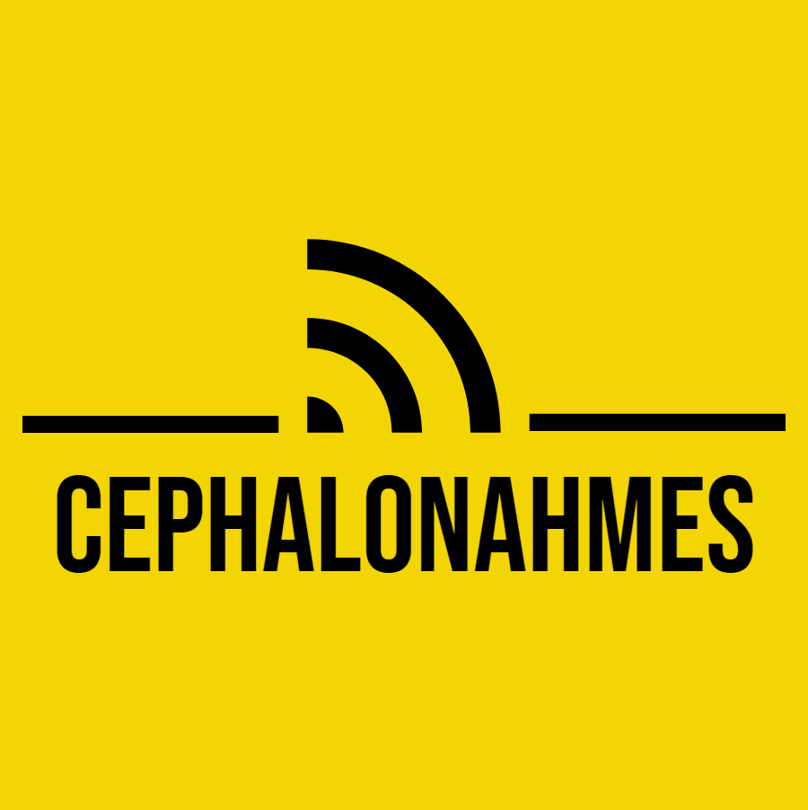

<!-- PROJECT SHIELDS -->
[![Contributors][contributors-shield]][contributors-url]
[![Forks][forks-shield]][forks-url]
[![Stargazers][stars-shield]][stars-url]
[![Issues][issues-shield]][issues-url]
[![MIT License][license-shield]][license-url]
[![codecov][codecovshield]](https://codecov.io/gh/desmaraisp/CephalonAhmes)


<!-- PROJECT LOGO -->
<br />
<div align="center">
  <a href="https://github.com/desmaraisp/CephalonAhmes">
    
  </a>

  <p align="center">
		AWS Lambda-hosted rss feed parser used to read update notes from the <a href="https://forums.warframe.com">warframe official forums</a> and post them to the <a href="https://reddit.com/r/warframe">warframe community subreddit</a>
    <br />
    <a href="https://github.com/desmaraisp/CephalonAhmes/issues">Report Bug or Request Feature</a>
  </p>
</div>

- [About The Project](#about-the-project)
	- [Built With](#built-with)
- [Getting Started](#getting-started)
	- [Prerequisites](#prerequisites)
	- [Local Setup](#local-setup)
	- [Local deployment to AWS](#local-deployment-to-aws)
- [Configuration](#configuration)
- [Contributing](#contributing)
- [License](#license)
- [Contact](#contact)
- [Acknowledgments](#acknowledgments)


<!-- ABOUT THE PROJECT -->
## About The Project

This reddit bot focuses on parsing rss feeds like this [one](https://forums.warframe.com/forum/123-developer-workshop-update-notes.xml) and converting them into reddit-compatible markdown.

You can see <a href="https://www.reddit.com/r/Warframe/comments/gbjmoz/warframe_revised_railjack_revisited_part_1_update/fp63u3r/">here</a> the reason behind the creation of this project. You can also see the full list of submissions made by the bot over <a href="https://www.reddit.com/r/Warframe/search/?q=author%3Acephalonahmes&sort=top&restrict_sr=on&t=all">here</a>.


### Built With

This project uses the following technologies, among others:
* <span style="vertical-align: middle;">[![Python][python-shield]][python-url]</span>

* <span style="vertical-align: middle;">[![Docker][docker-shield]][docker-url]</span>

* <span style="vertical-align: middle;">![Lambda][lambda-shield]</span>

* SAM CLI/AWS CloudFormation


<!-- GETTING STARTED -->
## Getting Started

To get a local copy up and running, follow these simple example steps.

### Prerequisites

* docker
* VSCode
* [devcontainers extension](https://marketplace.visualstudio.com/items?itemName=ms-vscode-remote.remote-containers)
* python (only if you decide not to use VSCode devcontainers)


### Local Setup

1. [Create a new reddit application](https://github.com/reddit/reddit/wiki/OAuth2-Quick-Start-Example#first-steps)
2. [Create an AWS key pair](https://docs.aws.amazon.com/accounts/latest/reference/root-user-access-key.html)
3. Clone the repo
   ```sh
   git clone https://github.com/desmaraisp/CephalonAhmes.git
   ```
4. Create .envvars file, then update all secrets using the previously created values
   ```sh
   cp ./.envvars.template ./.envvars
   ```
5. Open directory using VSCode devcontainer


### Local deployment to AWS

Once you've started your devcontainer, all the tools required to start your own instance of CephalonAhmes should be ready to use. You might want to update the configuration first though, but once you've configured everything, start a bash prompt in vscode and use the following query to create your AWS Lambda function:

```sh
aws cloudformation deploy --stack-name CephalonAhmesPipelineResources  --template-file SAMDeploy/SAMPreliminaryDeploy.yml

RepositoryUri=$(aws cloudformation list-exports --query "Exports[?Name=='CephalonAhmesRepositoryUri'].Value" --no-paginate --output text)

sam build --template-file ./SAMDeploy/SAMTemplate.yaml

sam deploy --config-file ./SAMDeploy/samconfig.toml --image-repositories "CephalonAhmesFunction=$RepositoryUri" --parameter-overrides "CEPHALONAHMESPRAWCLIENTID=$CEPHALONAHMES_PRAW_CLIENT_ID CEPHALONAHMESPRAWCLIENTSECRET=$CEPHALONAHMES_PRAW_CLIENT_SECRET CEPHALONAHMESPRAWPASSWORD=$CEPHALONAHMES_PRAW_PASSWORD CEPHALONAHMESPRAWUSERNAME=$CEPHALONAHMES_PRAW_USERNAME ConfigurationName=base"
```

This will use the values we've configured in the `.envvars` file to configure aws cli authentication and to upload environment variables to AWS Lambda upon deploying.


## Configuration

All the project settings can be found in the [settings file](./settings.base.toml). It is possible to override the base settings by adding another settings file, such as the [test settings](./settings.test.toml) and by specifying the `ConfigurationName` env variable.

You can also directly override configuration items by setting environment variables formatted as such: `CEPHALONAHMES_[Name of the setting you want to override]`. For example, to override the `PRAW_PASSWORD` setting, set an env var for `CEPHALONAHMES_PRAW_PASSWORD`.

For a full list of all configuration items, see [here (wip)](https://github.com/desmaraisp/CephalonAhmes/wiki)


<!-- CONTRIBUTING -->
## Contributing

Contributions are what make the open source community such an amazing place to learn, inspire, and create. Any contributions you make are **greatly appreciated**.

If you have a suggestion that would make this better, please fork the repo and create a pull request. You can also simply open an issue with the tag "enhancement".
Don't forget to give the project a star! Thanks again!

1. Fork the Project
2. Create your Feature Branch (`git checkout -b feature/AmazingFeature`)
3. Commit your Changes (`git commit -m 'Add some AmazingFeature'`)
4. Push to the Branch (`git push origin feature/AmazingFeature`)
5. Open a Pull Request


<!-- LICENSE -->
## License

Distributed under the MIT License. See `LICENSE` for more information.


<!-- CONTACT -->
## Contact

[/u/desmaraisp](http://www.reddit.com/message/compose?to=desmaraisp&subject=Hello%20there!)


<!-- ACKNOWLEDGMENTS -->
## Acknowledgments

* [README template](https://github.com/othneildrew/Best-README-Template/blob/master/BLANK_README.md)
* [Logo Maker](https://express.adobe.com/express-apps/logo-maker/)


<!-- MARKDOWN LINKS & IMAGES -->
<!-- https://www.markdownguide.org/basic-syntax/#reference-style-links -->
[contributors-shield]: https://img.shields.io/github/contributors/desmaraisp/CephalonAhmes.svg?style=flat
[contributors-url]: https://github.com/desmaraisp/CephalonAhmes/graphs/contributors
[forks-shield]: https://img.shields.io/github/forks/desmaraisp/CephalonAhmes.svg?style=flat
[forks-url]: https://github.com/desmaraisp/CephalonAhmes/network/members
[stars-shield]: https://img.shields.io/github/stars/desmaraisp/CephalonAhmes.svg?style=flat
[stars-url]: https://github.com/desmaraisp/CephalonAhmes/stargazers
[issues-shield]: https://img.shields.io/github/issues/desmaraisp/CephalonAhmes.svg?style=flat
[issues-url]: https://github.com/desmaraisp/CephalonAhmes/issues
[license-shield]: https://img.shields.io/github/license/desmaraisp/CephalonAhmes.svg?style=flat
[license-url]: https://github.com/desmaraisp/CephalonAhmes/blob/master/LICENSE
[codecovshield]: https://codecov.io/gh/desmaraisp/CephalonAhmes/branch/master/graph/badge.svg?token=8BAQOWNCCO

[python-shield]: https://img.shields.io/badge/python-DD0031?style=for-the-badge&logo=python&logoColor=white
[python-url]: https://www.python.org/
[docker-shield]: https://img.shields.io/badge/docker-DD0031?style=for-the-badge&logo=docker&logoColor=white&color=blue
[docker-url]: https://www.docker.com/
[lambda-shield]: https://img.shields.io/badge/Lambda-DD0031?style=for-the-badge&logo=awslambda&logoColor=white&color=orange
